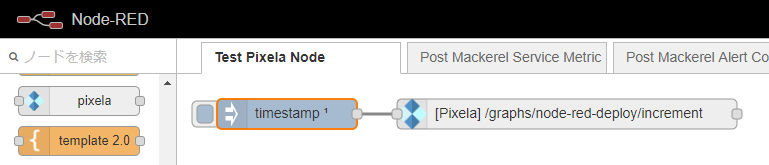
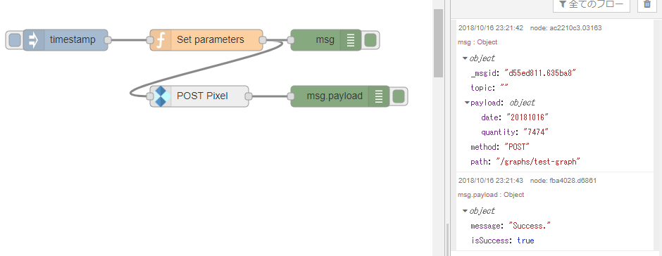

# node-red-contrib-pixela

This node is for calling [Pixela API](https://pixe.la/).

Icon was taken from https://pixe.la/.

> Icons made by <a href="http://www.freepik.com" title="Freepik">Freepik</a> from <a href="https://www.flaticon.com/" title="Flaticon">www.flaticon.com</a> is licensed by <a href="http://creativecommons.org/licenses/by/3.0/" title="Creative Commons BY 3.0" target="_blank">CC 3.0 BY</a>

## License

[MIT](LICENSE)

## Installation

This node was not published to npm.

See: [testing-your-node-in-node-red](https://nodered.org/docs/creating-nodes/first-node#testing-your-node-in-node-red)

```sh
git clone https://github.com/7474/node-red-contrib-pixela.git
cd node-red-contrib-pixela
npm link
```

## Sample

Grass growing per deploying "Flow".

```json
[{"id":"958a11ee.70698","type":"inject","z":"320bd89d.6ceb98","name":"","topic":"","payload":"","payloadType":"date","repeat":"","crontab":"","once":true,"onceDelay":0.1,"x":110,"y":60,"wires":[["31e9654b.236eaa"]]},{"id":"31e9654b.236eaa","type":"pixela","z":"320bd89d.6ceb98","name":"","method":"PUT","path":"/graphs/node-red-deploy/increment","apiclient":"484e28be.3ea4e8","x":390,"y":60,"wires":[[]]},{"id":"484e28be.3ea4e8","type":"pixela-client","z":"","name":"pixela-config"}]
```



----

This is the number of Koudenpa's deployment to Node-RED by Flow above.


----

Can override Node parameter with an input message.



Sample function node:
```javascript
msg.method = "POST";
msg.path = "/graphs/test-graph";
msg.payload = {
    date: "20181016",
    quantity: "7474"
};

return msg;
```